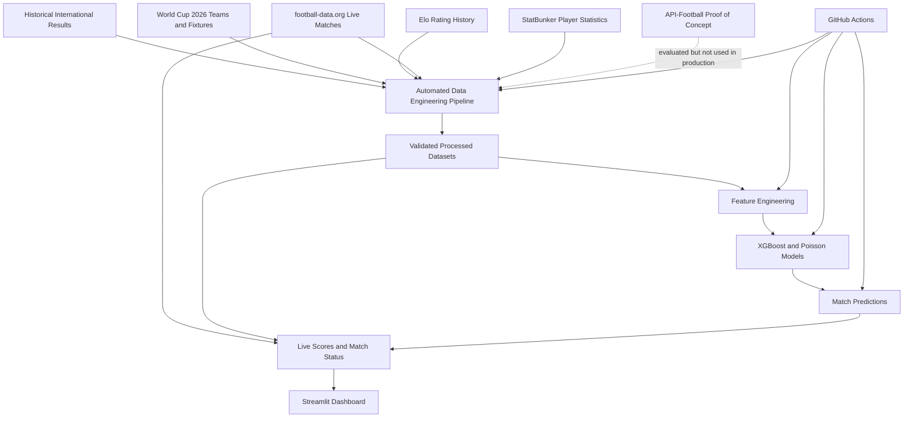

# World Cup 2026 Match Prediction - Presentation Notes

These notes are designed to help any teammate present the project without needing to know every implementation detail. The recommended story is simple: we combined several football data sources, automated the preparation and modeling workflow, and turned the results into an interactive tournament dashboard.

## 1. Project Overview

The World Cup 2026 Match Prediction project is an end-to-end football analytics product. It combines historical international match results, World Cup fixtures, Elo ratings, live tournament updates, and player statistics to produce match predictions and an interactive Streamlit dashboard.

The project solves two related problems. First, football data arrives from different sources with different names, formats, update schedules, and levels of detail. Second, predictions are only useful if the data behind them can be refreshed reliably and displayed in a form that people can understand.

The architecture therefore has three main layers:

1. **Data Engineering:** collects, cleans, standardizes, validates, joins, and stores the data.
2. **Data Science:** builds features, trains the XGBoost and Poisson models, and generates match probabilities.
3. **Analytics:** combines predictions with current results and presents them through Streamlit.

The end-to-end flow is:

```text
Raw football data
    -> cleaning and validation
    -> standardized processed datasets
    -> machine learning features
    -> trained models and predictions
    -> live result and knockout updates
    -> Streamlit dashboard
```

**Speaker notes:**  
"Our project is more than a prediction model. It is a complete data product. We start with raw football data from several sources, make those sources consistent, build prediction features, train the models, and then combine the predictions with live tournament information in a dashboard. The main value is that the entire journey from source data to user-facing analytics is reproducible and automated."

## 2. Architecture Diagram



### What Each Block Represents

- **Historical International Results:** the long-term match history used to teach the models how teams perform.
- **World Cup Teams and Fixtures:** the reference structure for the 48 teams, 12 groups, venues, dates, and knockout slots.
- **Elo Rating History:** a time-aware measure of team strength.
- **football-data.org:** the production source for current World Cup scores, statuses, participants, and kickoff times.
- **StatBunker:** the free tournament-specific source used for available player statistics.
- **API-Football POC:** a technically useful provider that was tested but not adopted because its free plan did not expose the 2026 season.
- **Data Engineering Pipeline:** the Python modules coordinated by `main.py`.
- **Processed Datasets:** stable CSV contracts shared between Data Engineering, Data Science, and the dashboard.
- **Feature Engineering:** rolling form, goals, Elo difference, and head-to-head features.
- **Machine Learning Models:** an XGBoost classifier and a Poisson goal model.
- **Predictions:** home-win, draw, and away-win probabilities for World Cup fixtures.
- **Streamlit Dashboard:** the user-facing application that combines static context, predictions, and current results.
- **GitHub Actions:** the automation layer that runs the pipeline and preserves updated outputs.

**Speaker notes:**  
"This diagram shows why the project needed a layered architecture. The sources do not go directly into the dashboard. They first pass through the Data Engineering pipeline, which creates stable processed datasets. Those datasets feed both the models and the dashboard. Live results then override projections when a match is finished, so the dashboard always prefers reality over a prediction."

## 3. Data Sources

### Historical Match Results

The historical results dataset contains completed international matches with dates, home and away teams, scores, tournament names, and match outcomes. It covers enough history to calculate recent form and identify long-term performance patterns.

This is the primary dataset used to train the prediction models. The pipeline separates completed matches from future rows, standardizes country names, validates scores, and creates the target outcome: home win, draw, or away win.

It is used during the first cleaning stage, the base model dataset stage, feature engineering, and both model-training stages.

**Speaker notes:**  
"The historical results are the learning foundation of the project. The models cannot learn from the 2026 tournament alone, so we use many years of international football. From this history we calculate how often teams win or draw, how many goals they score and concede, and how they performed against each other."

### FIFA World Cup Fixtures

The fixture data defines the tournament itself. It contains the 12 groups, 72 group matches, 32 knockout matches, dates, stages, venues, cities, and placeholder slots for teams that are not known at the start of the competition.

This source tells the project which matches require predictions and how the tournament progresses. Fixture validation confirms that expected teams and stages are present. Fixture enrichment then adds team metadata and Elo context.

The original placeholder slots are preserved for traceability. A separate knockout resolver replaces those slots with confirmed teams when the live provider publishes them or when completed standings make a simple group placement certain.

**Speaker notes:**  
"The fixtures are the skeleton of the tournament. Historical data tells us what teams have done before, but the fixture file tells us who is scheduled to play, when, and where. It also gives us the bracket structure, including placeholders such as the winner of one match playing the winner of another."

### Elo Ratings

Elo is a numerical measure of team strength. A stronger team normally has a higher rating, and the rating changes over time as matches are played.

The project stores both historical Elo records and a latest snapshot. Historical ratings support time-aware modeling, while the latest snapshot is used for current team rankings, fixture enrichment, match comparisons, and dashboard displays.

The difference between the two teams' Elo ratings is one of the important model features because it summarizes relative strength in a compact and interpretable way.

**Speaker notes:**  
"Elo gives us a more useful measure than simply looking at a ranking position. The difference between two Elo ratings tells the model how large the strength gap is. We also show Elo in the dashboard because it gives users an understandable reason why one team may be favored."

### football-data.org - Production Live Source

football-data.org is the live provider used by the production pipeline. It supplies the current World Cup schedule, match IDs, kickoff timestamps, match status, confirmed teams, scores, penalty scores when available, and provider update timestamps.

This information is different from the historical training data because it changes during the tournament. A future match may have no score, a live match may be in progress, and a finished match becomes the source of truth for the dashboard and bracket.

The raw JSON is saved before transformation. It is then converted into `live_matches.csv`, which is used for current scores, latest results, upcoming matches, status labels, kickoff times, and confirmed knockout participants.

**Speaker notes:**  
"The historical sources are mostly stable, but live tournament data changes every day. football-data.org is the production source that tells us what is happening now. The most important rule is that a completed real result always overrides the model's earlier prediction."

### API-Football - Evaluated Proof of Concept

API-Football was tested because its API can provide fixtures, scores, standings, teams, lineups, events, match statistics, squads, logos, and player images when the selected competition and subscription plan support them.

For this project, the free plan returned no World Cup 2026 data because it only exposed older seasons. The POC code and report remain in the repository to demonstrate source evaluation, but API-Football is not the production live source.

This distinction is important during the presentation: API-Football demonstrated a possible future paid architecture, while football-data.org currently supplies live tournament information.

**Speaker notes:**  
"We did not simply choose the first API we found. We tested API-Football because it offers broad football coverage, including lineups and events. The free plan did not provide the 2026 season, so we documented the result and selected sources that fit the project's budget and portfolio goals."

### StatBunker

StatBunker provides free tournament-specific player tables. The current pipeline extracts player names, teams, positions, appearances, starts, substitute appearances, goals, assists, cards, and available shooting fields.

The processed outputs power the Top Performers section of the Teams page. The pipeline includes additional columns for future compatibility, but unavailable statistics such as passes, pass accuracy, tackles, saves, and advanced defensive actions are left empty rather than invented.

Because StatBunker is an HTML website rather than an official API, the raw pages are saved before transformation. If a refresh is temporarily rejected, the pipeline can transform the cached raw pages instead of losing all player data.

**Speaker notes:**  
"StatBunker gives the dashboard a player-level story. We can show real leaders for goals, assists, appearances, starts, and cards. We are careful not to fabricate advanced fields: if the free source does not provide a statistic, the dashboard hides it instead of pretending that it exists."

## 4. Data Engineering Pipeline

The root command `python main.py` runs 13 ordered stages:

1. **Clean historical results:** validate dates and scores, standardize names, and split historical and future records.
2. **Process Elo ratings:** clean rating history and build the latest qualified-team snapshot.
3. **Standardize teams and fixtures:** apply canonical team names such as `USA`, `Türkiye`, and `Czechia`.
4. **Enrich fixtures:** join fixture, team, venue, and Elo context.
5. **Build the base model dataset:** create the stable handoff from Data Engineering to Data Science.
6. **Fetch and transform live matches:** store raw JSON and create the dashboard-ready live table.
7. **Resolve knockout fixtures:** combine official slots, standings, confirmed teams, and completed results.
8. **Fetch and transform player data:** store raw HTML, normalize player fields, and validate outputs.
9. **Build ML features:** calculate recent form, scoring rates, Elo difference, and head-to-head features.
10. **Train XGBoost:** learn three-way match outcome probabilities.
11. **Train the Poisson model:** estimate scoring behavior and convert it into outcome probabilities.
12. **Generate batch predictions:** export predictions for all 72 known group-stage fixtures.
13. **Evaluate completed predictions:** compare the original favorite with the actual result.

The pipeline uses reusable functions rather than notebook-only logic. Critical outputs are written to `data/processed/`, while model artifacts are written to `models/`.

**Speaker notes:**  
"The important point is not memorizing all 13 stages. The story is that each stage has one responsibility and produces a clear output for the next stage. If something fails, the pipeline reports which stage failed. This makes the project easier to debug, rerun, automate, and hand over to another team member."

## 5. Automation

`main.py` is the orchestrator. It calls the pipeline functions in the correct dependency order and stops with a meaningful message if a critical stage fails.

GitHub Actions runs the same command in a clean cloud runner. The workflow:

- runs manually, on relevant code changes, and daily at 06:00 UTC;
- reads `FOOTBALL_DATA_API_KEY` from GitHub Secrets;
- regenerates processed datasets;
- refreshes live scores and player information;
- retrains the two production models;
- regenerates predictions and evaluation results;
- checks that required files are non-empty;
- verifies that both models use the `v2_h2h` contract;
- runs model and dashboard regression tests;
- uploads datasets, raw source snapshots, and models as artifacts;
- commits dashboard-ready outputs and production models back to the active branch.

Automation matters because manual notebook execution is difficult to reproduce and easy to forget. A single automated path means local runs and CI runs use the same logic.

**Speaker notes:**  
"Automation turns the project from a one-time analysis into a repeatable product. When new results arrive, we do not manually edit the dashboard. GitHub Actions runs the same pipeline, validates the outputs, and makes the refreshed data available to Streamlit."

## 6. Machine Learning Handoff

The Data Engineering pipeline prepares everything the Data Science layer requires:

- standardized team names;
- validated completed matches;
- non-null target outcomes;
- time-aware Elo values;
- recent form and goal statistics;
- head-to-head context;
- prediction-ready World Cup fixtures.

The main handoff files are:

| Output | Machine Learning Role |
| --- | --- |
| `model_training_base.csv` | Stable historical match base. |
| `features.csv` | Final feature matrix and target used for training. |
| `wc_2026_fixtures_enriched.csv` | World Cup fixtures requiring predictions. |
| `elo_latest.csv` | Current team strength lookup for inference. |

The XGBoost model learns nonlinear patterns for home win, draw, and away win. The Poisson model provides a separate goal-based perspective. Their probabilities are averaged to create the final ensemble prediction.

**Speaker notes:**  
"Data Engineering and Data Science are connected through explicit datasets rather than hidden notebook state. The models receive clean, documented features and produce a simple contract: three probabilities. This makes it possible for the dashboard team to use the predictions without needing to understand the training code."

## 7. Dashboard

The implemented Streamlit navigation contains six pages.

### Overview

The Overview summarizes tournament progress, completed matches, total goals, teams, model confidence, strongest Elo teams, upcoming matches, latest results, qualification probabilities, uncertainty, and the current top goalscorer.

Main inputs: `live_matches.csv`, `knockout_matches.csv`, `elo_latest.csv`, `predictions_2026.csv`, `player_stats.csv`, and simulation outputs.

### Match Details

This page lets the user browse group and resolved knockout fixtures. It displays status, Belgian kickoff time, venue, flags, Elo ratings, prediction probabilities, predicted score, actual score when available, model confidence, prediction uncertainty, and prediction evaluation for finished matches.

Main inputs: live matches, knockout matches, fixture enrichment, Elo ratings, and predictions.

### Groups

The Groups page calculates current standings from completed tournament results. It shows played matches, wins, draws, losses, goals, goal difference, points, qualification probability, predicted final points, and the next available group fixtures.

Main inputs: `live_matches.csv`, predictions, team metadata, and simulation outputs.

### Knockout Bracket

The bracket follows the official winner-slot paths. Confirmed participants and actual winners take priority. Future rounds are projected only where a real result is not yet available. The bracket also provides zoom and horizontal scrolling.

Main inputs: `knockout_matches.csv`, live results, team metadata, and round-reach simulations.

### Teams

The Teams page provides an Elo-ranked team selector, country-themed presentation, FIFA and Elo context, tournament record, qualification outlook, team summary, recent matches, and available player leaders.

Main inputs: team metadata, Elo ratings, group standings, simulations, live matches, `player_profiles.csv`, and `player_stats.csv`.

### About

The About page explains the model, data sources, and interpretation limits so users understand that probabilities are analytical estimates rather than guaranteed outcomes.

There are not separate production pages named Live Matches, Match Predictions, or Player Analytics. Those capabilities are integrated into Match Details, Overview, and Teams.

**Speaker notes:**  
"The dashboard is organized around the questions a football viewer would ask: What is happening in the tournament? What does the model think about a match? How is a group developing? What is the knockout path? How is a team performing? Each page combines multiple processed datasets, but the user sees one coherent story."

## 8. Validation and Reliability

Reliability is handled at several levels:

- **Input validation:** required raw files and columns must exist.
- **Schema validation:** processed datasets must contain their agreed fields.
- **Duplicate checks:** natural keys such as match ID and player/team identity are checked.
- **Missing-value handling:** future scores and unknown knockout participants are accepted only where nulls are expected.
- **Team normalization:** variant country names are mapped to one project-wide convention.
- **API safety:** tokens come from environment variables or GitHub Secrets and are never hardcoded.
- **Source fallback:** cached StatBunker HTML can be used when a refresh fails.
- **Freshness information:** live provider update times and player snapshot times are shown in the dashboard.
- **Result precedence:** completed scores override model projections.
- **Model compatibility:** CI verifies that both artifacts use the `v2_h2h` version.
- **Automated tests:** the current suite validates features, models, predictions, knockout behavior, null safety, and dashboard contracts.
- **Caching:** dashboard loaders use a short TTL so data is efficient to read without remaining stale indefinitely.

At the final audit, the full pipeline completed successfully and the automated suite reported 51 passing production tests. The legacy v1 test contract remains documented but is skipped because v2 is now the production model.

**Speaker notes:**  
"A successful pipeline run is not enough by itself. We also verify schemas, duplicates, expected nulls, model versions, and dashboard behavior. These checks reduce the risk that one source change silently breaks a later component."

## 9. Technologies Used

| Technology | Purpose | Why We Used It |
| --- | --- | --- |
| Python | Pipeline, modeling, automation, and dashboard language | One language can support the complete data product. |
| Pandas | Cleaning, transformation, joins, validation, and CSV output | It is efficient and readable for tabular football data. |
| XGBoost | Three-class match outcome model | It captures nonlinear relationships between form, Elo, and H2H features. |
| Poisson Model | Goal-based probability model | It adds a complementary football-specific modeling perspective. |
| football-data.org | Production live fixtures, status, participants, and scores | It provides the current 2026 data required by the dashboard. |
| API-Football | Source feasibility proof of concept | It helped evaluate a broader paid-provider architecture. |
| StatBunker | Free player-stat enrichment | It exposes tournament-specific player tables without a paid API plan. |
| Streamlit | Interactive dashboard | It allows a Python team to deliver a usable analytics application quickly. |
| GitHub Actions | Scheduled and event-driven pipeline automation | It provides reproducible cloud execution and secret management. |
| Git | Local version control | It tracks code, documentation, and data-contract changes. |
| GitHub | Collaboration, repository hosting, CI, and deployment source | It connects teamwork, automation, artifacts, and Streamlit deployment. |

**Speaker notes:**  
"The technology choices are intentionally practical. Python and Pandas cover the full data workflow, the two models provide complementary predictions, Streamlit turns the work into a product, and GitHub Actions removes the need for someone to run the refresh manually every day."

## 10. Challenges

### Combining Multiple Data Sources

Each source uses different schemas and update patterns. The solution was to preserve raw inputs, define processed contracts, and join only after normalization and validation.

### Standardizing Team Names

Names such as United States versus USA, Turkey versus Türkiye, and Czech Republic versus Czechia can break joins. A canonical naming layer is applied across historical results, fixtures, live data, Elo, and player tables.

### Handling Live API Updates

Future matches have null scores, knockout teams may initially be unknown, and statuses change over time. The live transformation creates explicit fields such as `is_finished`, `is_scheduled`, `has_score`, and `score_display`.

### Resolving the Knockout Bracket

The original fixture skeleton contained placeholders and some simplified pairings. A separate resolver preserves the original slots, follows the official match-number paths, uses confirmed provider teams, and advances actual winners before projections.

### Free Player Data Reliability

API-Football did not provide 2026 data on the free plan, while StatBunker can occasionally reject automated requests. The solution was a documented provider evaluation plus cached raw HTML fallback.

### Dashboard Caching

Permanent process-level caching could leave the deployed app showing yesterday's results. The dashboard now uses a five-minute TTL and file-aware model/data loading so updates appear without requiring a manual reboot.

### Pipeline Reliability

The pipeline spans external requests, large transformations, model training, and generated files. Modular stages, atomic model/prediction writes, schema checks, CI output checks, and regression tests make failures visible and reduce partial-output risk.

**Speaker notes:**  
"The hardest part was not one algorithm. It was making several imperfect sources behave like one trustworthy system. Most engineering decisions came from that need: canonical names, explicit statuses, cached fallbacks, source-of-truth rules, and automated validation."

## 11. Future Improvements

The current version is a portfolio-ready MVP. Logical future improvements include:

- replace or complement CSV storage with PostgreSQL or a cloud data warehouse;
- add Airflow when task-level retries, backfills, and operational history become necessary;
- containerize the pipeline and dashboard with Docker;
- use Kubernetes only if deployment scale and operational complexity justify it;
- deploy data and models to managed cloud storage rather than relying only on Git outputs;
- add monitoring for failed refreshes, stale data, schema drift, and prediction performance;
- send notifications when an API or pipeline stage fails;
- add a small source-status dataset with explicit successful-refresh timestamps;
- improve live event, lineup, and match-stat coverage through an appropriate licensed provider;
- add licensed player images and richer player analytics;
- retrain and recalibrate the models as more 2026 results become available;
- add model explainability so users can understand the main factors behind each prediction.

**Speaker notes:**  
"We would not add every enterprise technology immediately. The next step should follow a real need. A database and monitoring would improve reliability first. Airflow becomes valuable when we need task-level operations. Docker helps portability. Kubernetes only makes sense later if the product has enough traffic and services to require it."

## 12. Speaker Notes - Suggested Presentation Story

### Opening

"We built an end-to-end World Cup 2026 analytics product. It combines historical football data, team strength, current tournament results, player statistics, and machine learning predictions in one automated Streamlit dashboard."

### The Problem

"The main challenge was that football data comes from several sources and is not immediately compatible. Team names differ, live matches change status, future scores are empty, and knockout teams are initially placeholders. Before modeling anything, we needed a reliable data foundation."

### The Data Engineering Story

"Our pipeline collects and cleans the sources, standardizes every team name, validates the tournament structure, enriches fixtures, and creates stable datasets for the models and dashboard. The full workflow now runs through one command instead of requiring notebooks."

### The Modeling Story

"The prediction system combines two approaches. XGBoost learns complex relationships from recent form, goals, Elo, and head-to-head history. The Poisson model adds a goal-scoring perspective. We average their probabilities to produce the final home, draw, and away prediction."

### The Live Tournament Story

"Predictions never replace reality. football-data.org provides the current score and status, and a completed result becomes the source of truth. The same principle controls the knockout bracket: actual winners advance first, while the model only projects rounds that have not happened."

### The Dashboard Story

"The dashboard turns the pipeline into something useful for football viewers. Users can follow tournament progress, inspect match predictions and results, analyze groups, explore team and player statistics, and follow the knockout bracket."

### The Automation Story

"GitHub Actions runs the pipeline automatically, validates every major output, retrains the models, updates predictions, runs regression tests, and preserves the results. This makes the project reproducible even when the original developer is not present."

### Closing

"The strongest part of the project is the integration. It demonstrates Data Engineering, Data Science, analytics, software design, testing, automation, and source evaluation as one coherent product. The current version is a portfolio-ready v1.0 MVP with a clear path toward a production architecture."

### Useful Answers for Questions

**Why use both XGBoost and Poisson?**  
They model the problem differently. XGBoost learns flexible outcome patterns, while Poisson models scoring behavior. Combining them reduces dependence on one modeling assumption.

**Are the predictions guaranteed?**  
No. They are probabilities based on historical evidence and current features. Football remains uncertain, which is why the dashboard shows all three outcomes and model uncertainty.

**Why are some player fields empty?**  
The selected free source does not provide every advanced statistic reliably. Missing fields are left empty rather than fabricated.

**Why was API-Football not used in production?**  
Its free plan did not provide World Cup 2026 coverage. The team retained the POC and chose sources that met the project's cost and data requirements.

**What happens when a match finishes?**  
The live result overrides the prediction for standings, scores, and bracket advancement. The original prediction remains useful for evaluation.

**What happens if StatBunker is unavailable?**  
The pipeline warns about the failed refresh and uses cached raw player pages when available.

**What is the main limitation today?**  
The application depends on CSV-based storage and free external sources. It has freshness timestamps, but production monitoring, alerting, richer live statistics, and a database would be the next reliability improvements.
